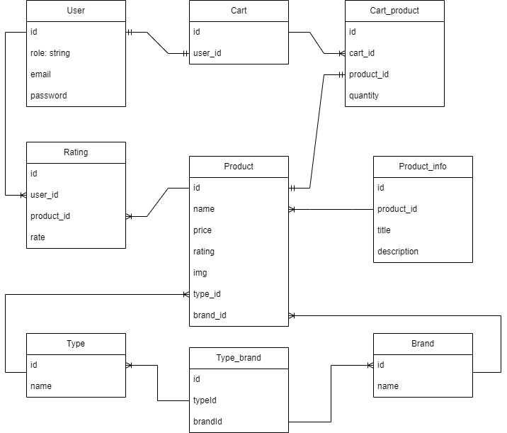

# Online-shop

The project is an online shopping application designed to provide users with an interactive platform to browse,
select, and purchase products.
It offers a user-friendly interface where users can view available items,
add them to their cart, and complete the checkout process seamlessly.

## Table of Contents

- [Overview](#overview)
- [Features](#features)
- [Technologies Used](#technologies-used)
    - [Frontend](#frontend)
    - [Backend](#backend)
    - [Database](#database)
    - [IDE](#ide)
- [Getting Started](#getting-started)
- [Usage](#usage)
- [Contributing](#contributing)
- [License](#license)

## Overview

The online shopping application is built using modern web technologies (React & Node).
It leverages React on the frontend to create an engaging user interface with responsive design and intuitive navigation.
The backend is powered by Node.js and Express, facilitating seamless communication between the frontend and the database.
Sequelize, an ORM (Object-Relational Mapping) tool, is used for efficient database management,
ensuring smooth data retrieval and storage.

## Features

- **User Authentication:** Secure user authentication system using JSON Web Tokens (JWT) for login and registration.
- **Shopping Cart Functionality**: Enables users to add and remove products from their shopping cart with quantity tracking.
- **Product Management:** Facilitates CRUD (Create, Read, Update, Delete) operations for managing products.
- **Responsive Design:** Ensures a seamless experience across various devices with a responsive and user-friendly interface.
- **Role-based** Access Control: Implements role-based access control to restrict access to certain features based on user roles.
- **File Upload:** Allows users to upload images or files, such as product images, using file upload functionality.
- **Database Integration:** Integrates with a PostgreSQL database for storing user data, products, and cart information.
- **State Management:** Utilizes MobX for efficient state management in the frontend, ensuring smooth data handling and reactivity.
- **Routing and Navigation**: Implements React Router for navigation, allowing users to navigate between different sections of the application seamlessly.

## Technologies Used

### Frontend

- **React**: A JavaScript library for building user interfaces. It allows developers to create reusable UI components that efficiently update and render data changes.
- **React-Router-Dom**: A library used for navigation and routing in React applications. It enables developers to create declarative routing using components.
- **MobX**: A state management library that makes state management simple and scalable by using observable objects, reactions, and actions.
- **React**-Bootstrap: A library containing Bootstrap components that are rebuilt with React. It provides pre-styled components for easier frontend development.
- **Axios**: A promise-based HTTP client used for making HTTP requests in the frontend. It provides an easy-to-use interface for performing asynchronous operations.
- **Vite**: A build tool that provides a faster development experience by leveraging modern JavaScript features and efficient bundling techniques.
- **jwt-decode**: A library used to decode JWTs (JSON Web Tokens) in the frontend. It extracts information from JWTs without requiring a server request.

### Backend

- **Node**: A JavaScript runtime environment that executes JavaScript code outside of a web browser. It's used for building scalable and high-performance applications.
- **Express**: A minimalist web framework for Node.js. It simplifies the creation of robust APIs and web applications.
- **Sequelize**: An ORM (Object-Relational Mapping) for Node.js. It provides an easy way to interact with databases by mapping objects to database tables.
- **JWT (JSON Web Tokens)**: A standard for securely transmitting information between parties as a JSON object. It's commonly used for authentication and authorization.
- **nodemon**: A utility for automatically restarting the Node.js server during development whenever changes are detected.
- **bcrypt**: A library used for password hashing. It securely hashes passwords to protect user credentials.
- **cors**: A package that enables Cross-Origin Resource Sharing in Node.js applications. It allows controlled access to resources from different origins.
- **dotenv**: A module that loads environment variables from a .env file into process.env.
- **PostgreSQL**: An open-source relational database management system known for its reliability and robustness.
- **pg**: A PostgreSQL client for Node.js. It enables Node.js applications to interact with PostgreSQL databases.
- **pg-hstore**: A node package used for serializing and deserializing JSON data to hstore format in PostgreSQL.
- **express-fileupload**: Middleware for handling file uploads in Express applications.
- **uuid**: A package for generating universally unique identifiers (UUIDs).
- **sharp**: A high-performance image processing library used for image manipulation in Node.js.

### Database
- **PostgreSQL**: Open-source relational database.
- **Database Schema**
  

### IDE
- **WebStorm**: An Integrated Development Environment (IDE) for modern JavaScript development.

## Getting Started

To run the online-shop Application locally:

1. Clone the repository.
2. Navigate to the project directory.
3. Install dependencies: `npm install`.
4. Start the development server: `npm start`.

## Usage

Explore and enjoy the full functionality of the application, including:

- User registration and login to access personalized features.
- Adding products to your shopping cart with ease and managing quantities effortlessly.
- Browsing through a variety of products available for purchase.
- Editing, updating, or removing items from your shopping cart.
- Seamless navigation across different sections of the application.
- Accessing and managing your account details and preferences.
Get started and experience the comprehensive set of features provided by the application to enhance your shopping experience.

## Contributing

Contributions to the project are welcome! If you'd like to contribute, please fork the repository and create a pull request.

## License

This project is licensed under the MIT License. See the [LICENSE](./LICENSE) file for details.